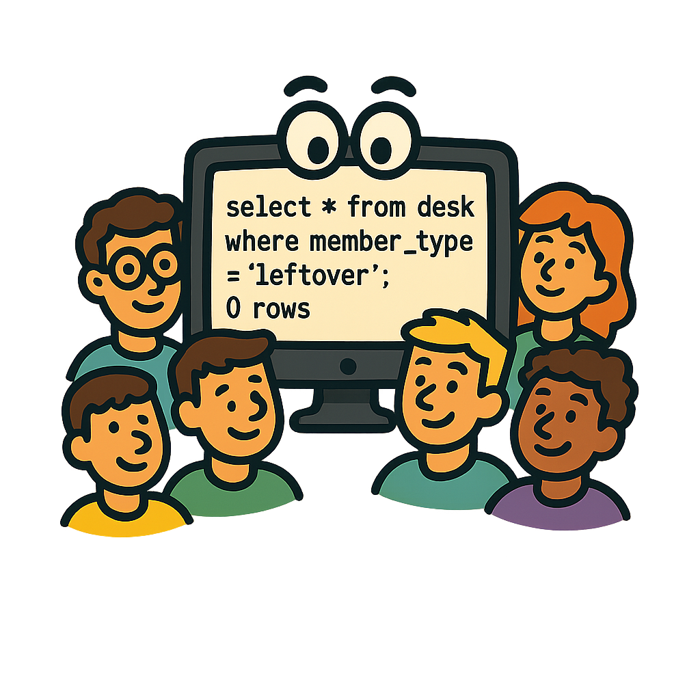

<div align="center">

# API 6th Semester BD - NoDesk

</div>

<p align="center">
  
</p>

<p align="center">
    | <a href ="#challenge">Challenge</a> |
    <a href ="#solution">Solution</a> |
    <a href ="#requirements">Requirements</a> |
    <a href ="#backlog">Product Backlog</a> |
    <a href ="#dor">DoR</a> |
    <a href ="#dod">DoD</a> |
    <a href ="#sprint">Sprint Schedule</a> |
    <a href ="#technologies">Technologies</a> |
    <a href ="#manual">Installation Manual</a> |
    <a href ="#team">Team</a> |
</p>

<br>

> Project Status: In Development 🚧
>
> Documentation Folder: [Link](documentation) 📄
>
> Project Video: 📽️

<br>

## 🎯 Challenge <a id="challenge"></a>

Pro4tech faces difficulties in making strategic decisions due to the lack of a clear and consolidated analysis of the call data received by the support team. The lack of a centralized tool to generate insights forces managers to base their actions on intuition rather than concrete data, making it difficult to prevent problems for the customer and optimize resources.

<br>

## 💡 Solution <a id="solution"></a>

Develop the <**_> platform, a Business Intelligence (BI) tool that connects to Pro4tech's database to modernize and analyze support data. The solution will transform raw data into visual and actionable insights through interactive dashboards. With <_**>, decision-makers will be able to quickly identify the most problematic projects and categories, track ticket progress, monitor team efficiency, and act proactively to improve customer satisfaction, all in compliance with the LGPD.

<br>

## 📋 Functional Requirements <span id="requirements">

<table>
    <tr>
        <th>ID</th>
        <th>Functional Requirements</th>
        <th>Description</th>
    </tr>
    <tr>
        <td>RF01</td>
        <td>Main Screen with Graphs (Dashboard)</td>
        <td>The system must have a home screen that visually displays graphs and the most important information extracted from the calls.</td>
    </tr>
    <tr>
        <td>RF02</td>
        <td>Score Critical Applications</td>
        <td>Users need to easily see which applications generate the most calls to identify quality issues that are below expectations.</td>
    </tr>
    <tr>
        <td>RF03</td>
        <td>View Call Evolution</td>
        <td>The tool should display a graph showing how the number of calls in each category increases or decreases over time.</td>
    </tr>
    <tr>
        <td>RF04</td>
        <td>Access Management</td>
        <td>Allow an administrator user to register, edit, and remove other users' access to the platform.</td>
    </tr>
    <tr>
        <td>RF05</td>
        <td>Show Overdue Calls</td>
        <td>The system needs to display how many calls have already exceeded the delivery deadline (SLA) to identify gaps in the support team's performance.</td>
    </tr>
    <tr>
        <td>RF06</td>
        <td>Score Critical Subcategories</td>
        <td>The user needs to identify which subcategories generate the most calls to know which teams to contact to change strategies.</td>
    </tr>
    <tr>
        <td>RF07</td>
        <td>Show the average resolution time of the tickets</td>
        <td>The system needs to display the average resolution time of the tickets to monitor the support team’s efficiency and identify potential delays.</td>
    </tr>
    <tr>
        <td>RF08</td>
        <td>Score unhappy clients</td>
        <td>The system needs to display a ranking of the most dissatisfied clients to take actions that prevent contract termination.</td>
    </tr>
    <tr>
        <td>RF09</td>
        <td>Screen showing customer satisfaction levels</td>
        <td>The system must enable the user to filter a specific client to see their satisfaction level and product(s) performance, allowing the user to manage the client relationship.</td>
    </tr>
  
</table>

## 📋 Non-Functional Requirements

<table>
    <tr>
        <th>ID</th>
        <th>Non-Functional Requirements</th>
        <th>Description</th>
    </tr>
    <tr>
        <td>RNF01</td>
        <td>LGPD Compliance</td>
        <td>The system must process data in compliance with the General Data Protection Law (LGPD).</td>
    </tr>
    <tr>
        <tr>
        <td>RNF02</td>
        <td>Persistence Architecture</td>
        <td>The solution must use a non-relational database (NoSQL) to store and query processed data, ensuring scalability and flexibility.</td>
    </tr>
    <tr>
        <tr>
        <td>RNF03</td>
        <td>Use of Artificial Intelligence</td>
        <td>The system must employ AI algorithms or services to generate insights.</td>
    </tr>
    <tr>
        <tr>
        <td>RNF04</td>
        <td>Access Security</td>
        <td>The system must ensure that only authenticated users with the appropriate permissions have access to the platform's data and features.</td>
    </tr>
    <tr>
        <tr>
        <td>RNF05</td>
        <td>Usability and Documentation</td>
        <td>The platform must have an intuitive interface for business users and be accompanied by a manual detailing its functionalities (User Manual).</td>
    </tr>
</table>

<br>

## 📋 Product Backlog <a id="backlog"></a>

<table>
    <tr>
        <th>Rank</th>
        <th>Priority</th>
        <th>User Story</th>
        <th>Story Points</th>
        <th>Sprint</th>
        <th>Customer Requirement</th>
        <th>Status</th>
    </tr>
    <tr align="center">
        <td>1</td>
        <td>High</td>
        <td align="left">As a decision-maker, I want to know which projects have the highest number of requests so I can prioritize improvement actions.</td>
        <td>8</td>
        <td>1</td>
        <td>RF01, RF02</td>
        <td>🚧</td>
    </tr>
    <tr align="center">
        <td>2</td>
        <td>High</td>
        <td align="left">As a decision-maker, I want to identify the subcategories with the highest number of calls, so I can review action plans and reallocate resources to the most critical sectors.</td>
        <td>6</td>
        <td>1</td>
        <td>RF01, RF06</td>
        <td>✅</td>
    </tr>
    <tr align="center">
        <td>3</td>
        <td>High</td>
        <td align="left">As a decision-maker, I want to analyze the evolution of the number of calls in recent months, segmented by category, to measure the impact of the actions implemented and adjust the strategy when necessary.</td>
        <td>8</td>
        <td>1</td>
        <td>RF01, RF03</td>
        <td>✅</td>
    </tr>
    <tr align="center">
        <td>4</td>
        <td>High</td>
        <td align="left">As a customer, I want my employees to use an application that complies with the LGPD to avoid legal issues.</td>
        <td>10</td>
        <td>1 e 2</td>
        <td>RNF01</td>
        <td>🚧</td>
    </tr>
    <tr align="center">
        <td>5</td>
        <td>High</td>
        <td align="left">As a decision-maker, I want to know the most dissatisfied clients so that I can take actions to retain them.</td>
        <td>10</td>
        <td>2</td>
        <td>RF08</td>
        <td>🚧</td>
    </tr>
    <tr align="center">
        <td>6</td>
        <td>Medium</td>
        <td align="left">As a decision-maker, I want to filter a specific client and see their satisfaction level and the performance of the products they have contracted so that I can work on the relationship with that client.</td>
        <td>10</td>
        <td>3</td>
        <td>RF09</td>
        <td>🚧</td>
    </tr>
    <tr align="center">
        <td>7</td>
        <td>Medium</td>
        <td align="left">As a decision-maker, I want to visualize the number of overdue calls to assess the efficiency of the support team and identify potential bottlenecks in service.</td>
        <td>2</td>
        <td>2</td>
        <td>RF01, RF05</td>
        <td>🚧</td>
    </tr>
    <tr align="center">
        <td>8</td>
        <td>Medium</td>
        <td align="left">As a decision-maker, I want to see the average ticket resolution time to track the efficiency of the support team.</td>
        <td>2</td>
        <td>2</td>
        <td>RF01, RF07</td>
        <td>🚧</td>
    </tr>
    <tr align="center">
        <td>9</td>
        <td>Low</td>
        <td align="left">As a relationship manager, I want to register application users to control which employees have access to insights.</td>
        <td>5</td>
        <td>3</td>
        <td>RF04</td>
        <td>🚧</td>
    </tr>
</table>

<br>

## 🏃‍ DoR - Definition of Ready <a id="dor"></a>

- User Stories with **Acceptance Criteria**
- Subtasks divided **from the User Stories**
- Design in **Figma**
- **Database** Modeling
- External dependencies **are resolved or mapped**

## 🏆 DoD - Definition of Done <a id="dod"></a>

- User Manual
- Application Manual
- API (Application Programming Interface) Documentation
- Complete Code
- Videos of each delivery stage

<br>

## 📅 Sprint Schedule <a id="sprint"></a>

<table>
    <tr>
        <th>SPRINT</th>
        <th>PERIOD</th>
        <th>DESCRIPTION</th>
    </tr>
    <tr>
        <td>Kick-off</td>
        <td>25/08/2025 à 29/08/2025</td>
        <td>Initial team alignment, presentation of the project theme and definition of roles and responsibilities.</td>
    </tr>
    <tr>
        <td>Sprint 1</td>
        <td>08/09/2025 à 28/09/2025</td>
        <td>Develop the dashboard's main structure. Implement ranking views of projects and categories with the most requests. Create a graph analyzing the evolution of the number of requests over time. Begin structuring data processing, ensuring compliance with the LGPD.</td>
    </tr>
    <tr>
        <td>Sprint 2</td>
        <td>06/10/2025 à 26/10/2025</td>
        <td>-</td>
    </tr>
    <tr>
        <td>Sprint 3</td>
        <td>03/11/2025 à 23/11/2025</td>
        <td>-</td>
    </tr>
    <tr>
        <td>Solutions Fair</td>
        <td>04/12/2025</td>
        <td>Presentation of the final version of the project developed by the team.</td>
    </tr>
</table>

<br>

## 💻 Technologies <a id="technologies"></a>

<h4 align="center">
 <a href="https://www.python.org/"></a>
 <a href="https://fastapi.tiangolo.com/"></a>
 <a href="https://www.typescriptlang.org/"></a>
 <a href="https://vuejs.org/"></a>
 <a href="https://nuxt.com/"></a>
 <a href="https://www.postgresql.org/"></a>
 <a href="https://www.mongodb.com/"></a>
 <a href="https://www.atlassian.com/software/jira"></a>
 <a href="https://github.com/"></a>
 <a href="https://github.com/features/actions"></a>
 <a href="https://www.figma.com/"></a>
</h4>

<br>

## 📖 Installation Manual <a id="manual"></a>

### 🛠 Prerequisites

- Git ([Download](https://git-scm.com/downloads))
- Python 3.13+ ([Download](https://www.python.org/downloads))
- Node.js 20+ ([Download](https://nodejs.org/en/download))
- Poetry ([Documentation](https://python-poetry.org/))

### 1. Clone the Main Repository

```bash
git clone https://github.com/NoDesk-6BD/6sem2025Main.git
cd 6sem2025Main
```

### 2. Backend Configuration

1. Clone the repository:

   ```bash
   git clone https://github.com/NoDesk-6BD/6sem2025Backend.git
   cd 6sem2025Backend
   ```

2. Install and prepare the Python environment with Poetry:

   ```bash
   poetry config virtualenvs.in-project true
   poetry install
   cp -n .env.example .env
   source .venv/bin/activate
   ```

3. Generate an APP_SECRET for the `.env` file:

   ```bash
   python -c "import secrets; print(secrets.token_urlsafe(64))"
   ```

4. Run the backend in development mode:

   ```bash
   uvicorn nodesk:app --reload --port 8000
   ```

   **Expected Output:**

   - Health: [http://127.0.0.1:8000/health](http://127.0.0.1:8000/health)
   - Docs: [http://127.0.0.1:8000/docs](http://127.0.0.1:8000/docs)

5. To run tests:

   ```bash
   pytest
   ```

6. Code quality:

   ```bash
   ruff format .
   ruff check .
   ```

### 3. Frontend Configuration

1. Clone the repository:

   ```bash
   git clone https://github.com/NoDesk-6BD/6sem2025Frontend.git
   cd 6sem2025Frontend
   ```

2. Install the Nuxt project dependencies:

   ```bash
   npm install
   ```

3. Run the frontend in development mode:

   ```bash
   npm run dev
   ```

   **Expected Output:**

   - App: [http://localhost:3000](http://localhost:3000)

4. To run tests:

   ```bash
   npm run test
   ```

5. Code quality:

   ```bash
   npm run lint
   npm run format
   ```

<br>

## 👥 Team <a id="team"></a>

<table>
    <tr>
        <th>IDENTIFICATION</th>
        <th>NAME</th>
        <th>POSITION</th>
        <th>SOCIAL MEDIA</th>
    </tr>
    <tr>
        <td></td>
        <td>Tânia Cruz</td>
        <td>Product Owner</td>
        <td><a href="https://www.linkedin.com/in/t%C3%A2nia-cruz-30ab5812a/"></a>
<a href="https://github.com/taniacruzz"></a></td>
    </tr>
    <tr>
        <td></td>
        <td>Lucas Henrique</td>
        <td>Scrum Master</td>
        <td><a href="https://www.linkedin.com/in/lucas-henrique-9a557620b/"></a>
<a href="https://github.com/LucasHCOliveira7"></a></td>
    </tr>
    <tr>
        <td></td>
        <td>Willian Caboski</td>
        <td>Developer</td>
        <td><a href="https://www.linkedin.com/in/willian-caboski/"></a>
<a href="https://github.com/DankoCaboski"></a></td>
    </tr>
    <tr>
        <td></td>
        <td>Jhonny Dutra</td>
        <td>Developer</td>
        <td><a href="https://www.linkedin.com/in/dutrajy/"></a>
<a href="https://github.com/dutrajy"></a></td>
    </tr>
    <tr>
        <td></td>
        <td>Wallace Caetano</td>
        <td>Developer</td>
        <td><a href="https://www.linkedin.com/in/wallace-caetano/"></a>
<a href="https://github.com/UeresWally"></a></td>
    </tr>
    <tr>
        <td></td>
        <td>William Antoniazzi</td>
        <td>Developer</td>
        <td><a href="https://www.linkedin.com/in/williamantoniazzi/"></a>
<a href="https://github.com/williamantoniazzi"></a></td>
    </tr>
</table>
