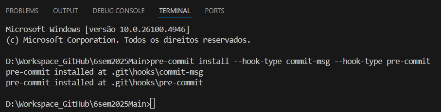
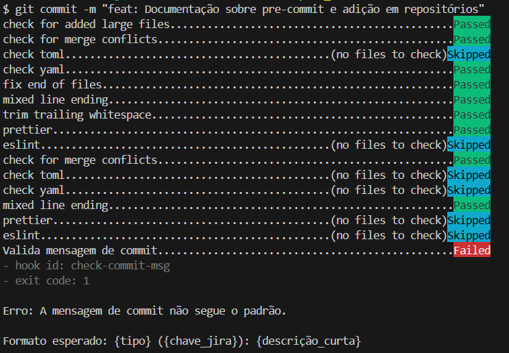

## Objetivo

Este documento visa padronizar as práticas de desenvolvimento em todos os repositórios do projeto, promovendo consistência, legibilidade e colaboração eficiente entre os membros da equipe. As diretrizes se aplicam a todas as partes interessadas, incluindo as equipes de Frontend, Backend e DevOps.

<br>

## Pre-commit Config

Todos os repositórios estão preparados para utilizar o `pre-commit` para padronizar os comites realizados pelo utilizado durante o desenvolvimento do projeto. Essa padronização são baseadas na [Conventional Commits](https://www.conventionalcommits.org/en/v1.0.0/).

Em todos os repositórios haverá na raiz do projeto o arquivo `.pre-commit-config.yaml`, configurado para atender a linguagem utilizada em cada repositório seja Documentação, Frontend, Backend ou DevOps.

<br>

### Ativação do pre-commit:

Após clonar o repositório o desenvolvedor deverá instalar e ativar o `pre-commit`através do comando:

Instalação e ativação:

```bash
pre-commit install --hook-type commit-msg --hook-type pre-commit
```

_Demais informações também pode ser avaliadas no README.md de cada repositório._

_Formato padrão, exemplo e tipos permitidos, consultar [padrão-branch-commit.md](./padrao-branch-commit.md)_

<br>

### Utilização do pre-commit:

Instalação e ativação:


Utilizando commit fora do padrão:


Utilizando commit detro do padrão:

