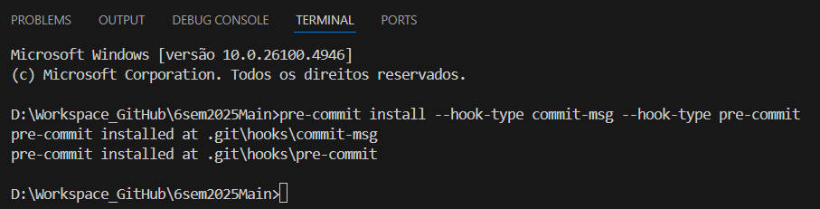
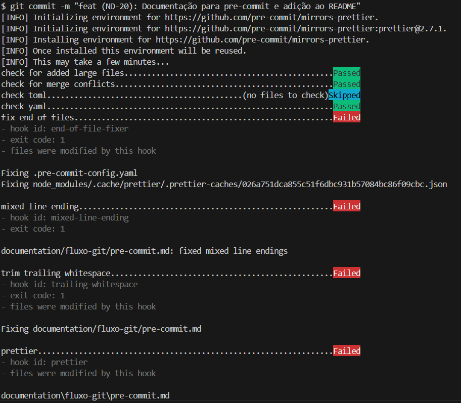
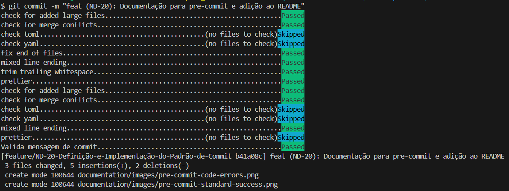

## Objective

This document aims to standardize development practices across all project repositories, promoting consistency, readability, and efficient collaboration among team members. The guidelines apply to all stakeholders, including Frontend, Backend, DevOps and ETL teams.

<br>

## Pre-commit Config

All repositories are prepared to use `pre-commit` to standardize the commits used during project development. This standardization is based on [Conventional Commits](https://www.conventionalcommits.org/en/v1.0.0/).

All repositories will have a `.pre-commit-config.yaml` file at the project root, configured to match the language used in each repository, whether Documentation, Frontend, Backend, or DevOps.

<br>

### Enabling pre-commit:

After cloning the repository, the developer must install and enable `pre-commit` using the command:

Installation and activation:

```bash
pre-commit install --hook-type commit-msg --hook-type pre-commit
```

_Further information can also be found in each repository's README.md._

_For the standard format, example, and allowed types, see [standard-branch-commit.md](./standard-branch-commit.md)_

<br>

### Using pre-commit:

Installation and activation:



<br>

Using commit outside of Standard:


<br>

Using non-standard commit, but with code errors (ESlint/Prettier):



<br>

Using non-standard commit, and all validations passed:


